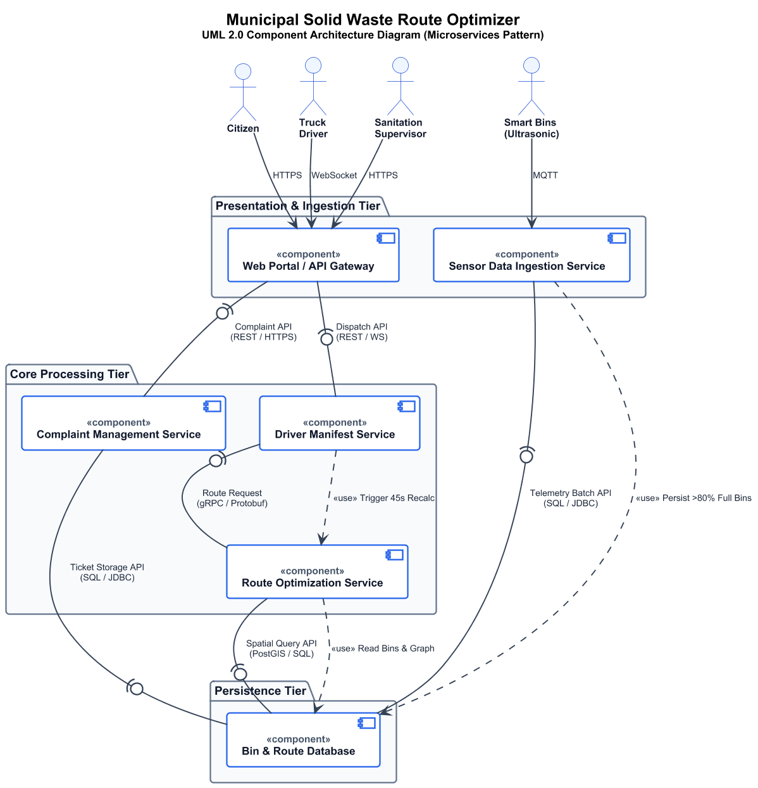

# Municipal Solid Waste Route Optimizer (SE Lab 1 & 3)

---

## Visual Component Diagram Preview

---

## Scenario & System Requirements

The **Municipal Solid Waste Route Optimizer** is an intelligent city sanitation management platform designed to automate and optimize municipal waste collection:
1. **IoT Sensor Ingestion**: Ingests ultrasonic fill-level telemetry from **10,000 smart trash bins** distributed across urban sectors.
2. **Threshold-Based Dispatch**: Filters candidate collection points to include **only bins over 80% full**.
3. **High-Performance Optimization**: Solves the dynamic Vehicle Routing Problem (VRP) for **50 garbage trucks across 10,000 bins in under 45 seconds**.
4. **Complaint Lifecycle Tracking**: Logs, geo-references, and manages citizen reports regarding missed pickups and service disruptions.
5. **Key Actors**:
   - **Sanitation Supervisor**: Oversees fleet operations, triggers recalculations, and analyzes collection performance.
   - **Truck Driver**: Navigates active routes via turn-by-turn in-cab mobile manifests.
   - **Citizen**: Reports missed waste collections via citizen portal.
   - **Smart Bins**: Periodically transmits fill-level telemetry via cellular (NB-IoT/LTE-M).

---

## Architecture Specification (Microservices Pattern)

### 1. Presentation & Ingestion Tier
- **Web Portal / API Gateway (`<<component>>`)**: Single edge gateway handling TLS termination, JWT authentication, role-based access control (RBAC), and rate limiting.
- **Sensor Data Ingestion Service (`<<component>>`)**: Decoupled ingestion cluster consuming ultrasonic sensor readings via MQTT.

### 2. Core Processing Tier
- **Route Optimization Service (`<<component>>`)**: Dedicated compute worker providing the required **`Route Request`** assembly interface (`gRPC / Protobuf`) for sub-45-second route solving.
- **Driver Manifest Service (`<<component>>`)**: Manages truck schedules and streams active routes via WebSocket.
- **Complaint Management Service (`<<component>>`)**: Handles ticketing, SLA tracking, and status resolution for citizen reports.

### 3. Persistence Tier
- **Bin & Route Database (`<<component>>`)**: Multi-model data tier combining PostGIS (spatial geometry), TimescaleDB (sensor time-series), and Redis (manifest caching).

---

## Architectural Justification Summary

> **"We chose Microservices Architecture for the Municipal Solid Waste Route Optimizer System."**

- **Independent Computational Scaling**: Isolates the compute-intensive route optimizer on dedicated CPU/GPU nodes to reliably fulfill the sub-45-second recalculation target for 50 trucks and 10,000 bins.
- **Resilient Fault Isolation**: Separates continuous high-volume sensor telemetry and unpredictable citizen complaint spikes from core truck navigation and dispatch pipelines.
- **Granular Security Controls**: Centralized API Gateway enforces identity and rate limits, while network isolation and segmented database credentials mitigate blast radius in case of individual service vulnerability.
- **Protocol Specialization**: Uses low-overhead MQTT for sensor streaming, binary gRPC for low-latency dispatch calculations, and WebSocket for real-time driver updates.
